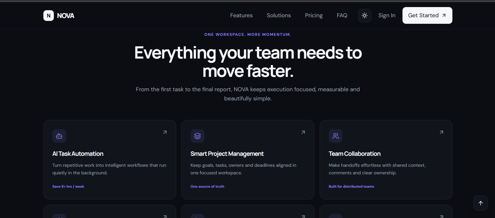

# NOVA — AI Productivity Platform

A production-quality React + Vite landing page concept for NOVA, a fictional AI-powered productivity platform. The project focuses on premium SaaS visual design, reusable React architecture, accessibility, responsive behavior, and real client-side interactions.

## Features
- Responsive desktop/tablet/mobile design
- Functional mobile navigation
- Dark/light mode with `localStorage` persistence and system preference fallback
- FAQ accordion with accessible ARIA state
- Monthly/annual pricing toggle
- HTML/CSS product dashboard mockups
- Smooth section navigation
- Lightweight IntersectionObserver scroll reveal
- Back-to-top control
- Responsive pricing, feature, solution and testimonial layouts
- Keyboard-visible focus states and reduced-motion support

## Technologies
- React
- Vite
- JavaScript
- Modern CSS
- Lucide React

## Installation

```bash
git clone <repository-url>
cd nova
npm install
npm run dev
```

For a production build:

```bash
npm run build
npm run preview
```

## Project Structure

```text
nova/
├── index.html
├── package.json
├── README.md
├── screenshots/
│   ├── desktop.png        # add after capturing the deployed page
│   └── mobile.png         # add after capturing the deployed page
└── src/
    ├── components/
    │   ├── CTA.jsx
    │   ├── Dashboard.jsx
    │   ├── FAQ.jsx
    │   ├── FeatureCard.jsx
    │   ├── Features.jsx
    │   ├── Footer.jsx
    │   ├── Hero.jsx
    │   ├── HowItWorks.jsx
    │   ├── Icon.jsx
    │   ├── Navbar.jsx
    │   ├── Pricing.jsx
    │   ├── ProductSection.jsx
    │   ├── SectionHeading.jsx
    │   ├── Solutions.jsx
    │   ├── Stats.jsx
    │   ├── Testimonials.jsx
    │   └── TrustedBy.jsx
    ├── data/
    │   └── content.js
    ├── App.jsx
    ├── index.css
    └── main.jsx
```

## Screenshots

Screenshots are intentionally not claimed as existing until they are captured from the running application.

### Desktop


### Mobile


## Live Demo

Live Demo: [Add deployment URL]

## AI Tools Used

- ChatGPT
- Claude

These tools were used for development assistance and implementation planning.

## Future Improvements

- Backend authentication
- Real database and team workspaces
- Stripe subscriptions
- Production AI integrations
- Notifications
- Real-time collaboration
- Analytics backend
- OAuth
- API integrations
- Automated end-to-end testing
- Production monitoring and error tracking
